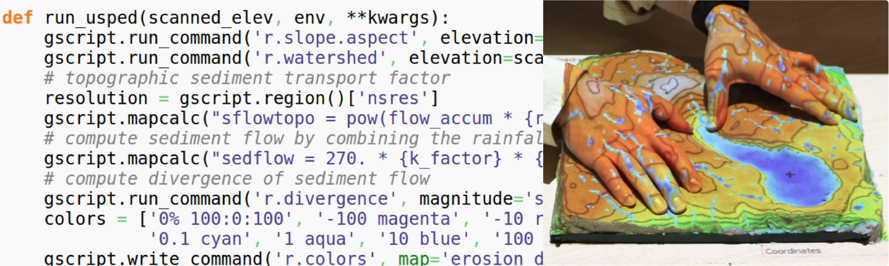

Aligning Computational Thinking with Tangible Landscape for Forest Fire Spread Modeling
========================================================================================

Grade level/course: Grade 9

Curriculum Developers: Michael A. Evans & Garrett Millar

Description
-----------
This lesson plan leads students through an introduction to computational science and applying its core concepts to real-world spatial phenomenon. Specifically, the lesson outlines the topic of Forest Fire Spread as a geohazard, aligned with geospatial modeling, geospatial technologies, and computer programming activities. Geospatial and computational thinking skills will be taught and developed, to then be put to the test on the last day of the lesson plan with  `Tangible Landscape <https://tangible-landscape.github.io/>`_.

Earth & Environmental Science Standards Covered
-------------------------------------------------
* EEn.2.1.4 - Explain the probability of and precautions that can be made to protect life from various geohazards such as: landslides, avalanches, earthquakes, and volcanoes in a particular area based on available data (including meteorological hazards).

Objectives
-----------
1. Understand forest fires and their effects with various simulations
2. Understand Computational Thinking concepts as they apply to modeling geohazards
3. Understand Geospatial Thinking concepts and Tangible Landscapes
4. Develop Computational and Geospatial Thinking skills

Instructor
-----------
William Burgess
Email: wburgess@wcpss.net

NC State Researchers
----------------------
`Michael Evans <https://ced.ncsu.edu/people/maevans6/>`_

Email: michael.a.evans@ncsu.edu

`Garrett Millar <https://gcmillar.github.io/>`_

Email: gcmillar@ncsu.edu

Summer Thompson

Email: sathomp9@ncsu.edu

Prerequisites
---------------
* Prior to this lesson, students must be able to:
    - Perform basic mouse manipulations such as point, click, and drag
    - Use a browser for experimenting with the activities

Schedule
----------

====== ========== ===
Day 1. April 16   `Introduction to computational science and subject area <topics/day-1.html>`_
Day 2. April 17   `Extending simulations <topics/day-2.html>`_
Day 3. April 18   `Introduction to GIS and tangible geospatial modeling <topics/day-3.html>`_
Day 4. April 19   `Geospatial modeling and analyses of wildfire spread <topics/day-4.html>`_
Day 5. April 20   `Tangible application of geospatial and computational thinking <topics/day-5.html>`_
====== ========== ===

Software
---------

Several geospatial (GIS) tools such as GRASS GIS and ArcGIS
will be discussed in connection with geography-related topics covered in the lesson plan as related to computational science.

All the software used in the course is open source, so students can
install it on their computers without obtaining licenses from the vendors
or through the university. Some free of charge services based on open
source software or focused on open science or open source development
will be used too.

Licensing
-----------

Shodor models & simulations
`````````````````````````````

Interactivate models and simulations are copyrighted material from the Shodor Education Foundation, Inc. Shodor, non-profit educational organization, was established in 1994 in Durham, NC and is dedicated to transforming learning by providing materials and instruction relating to computational science (scientific, interactive computing). Shodor’s curricular resources are licensed through the Creative Commons and freely available for non-commercial use with proper attribution.

Get to know
-------------


